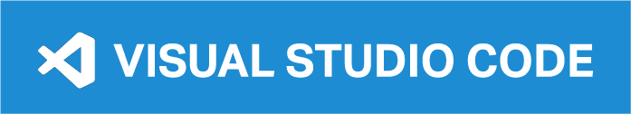

## Hi there, my name is Michèle 👋

### I am a strategic designer and passionate about brand & product management.

- 🤓 I am currently doing my full stack web development bootcamp 👩🏼‍💻 at the <a href="https://www.spiced-academy.com/de" target="blank">spiced academy</a>.
- 🧡 I did my master's degree in strategic design and my bachelor's degree in communication design; both at the [Hochschule für Gestaltung Schwäbisch Gmünd](https://www.hfg-gmuend.de/).
- 🧘‍♀️ In my free time I love doing yoga.
- 🌱 I am also a very active person and like to spend time in the nature, for example to go skiing with friends and family. ⛷
- 💬 Ask me about how to cook healthy … I have already created plenty of recipes for easy dishes. 🥗

### Feel free to contact me:

    

### My skills and toolkit:

Web Development

 
 
- Visual Studio Code
- html
- css
- js
- jquerry
- node.js
- sql
- vue.js
- [aws (amazon web services)]
- [react]
- [tailwindcss]

 

  

Design

 
 
 
  - Id
  - Xd
  - Ps
  - Ai
  - Premiere Rush

 
  

  

Others

 
 
 
  - Microsoft Word
  - Microsoft Excel
  - Microsoft PowerPoint
  - Atlassian Jira
  - Atlassian Confluence

 

<!--
**mrietzl/mrietzl** is a ✨ _special_ ✨ repository because its `README.md` (this file) appears on your GitHub profile.

Here are some ideas to get you started:

- 🔭 I’m currently working on ...
- 🌱 I’m currently learning ...
- 👯 I’m looking to collaborate on ...
- 🤔 I’m looking for help with ...
- 💬 Ask me about ...
- 📫 How to reach me: ...
- 😄 Pronouns: ...
- ⚡ Fun fact: ...

  

-->
