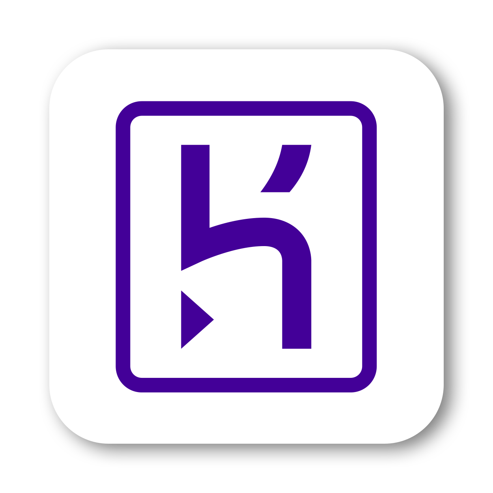

## Hi there, my name is Michèle 👋

Check out my webiste ➡️ <a href="https://mk-rietzl.de/" target="blank">mk-rietzl.de</a>

### I am a strategic designer and passionate about brand & product management.

- ✨ With great passion, I create individual corporate identities & product brandings as well as self-programmed website for different use cases; giving sustainable brands and products a unique stage to perform; online and offline.
- 🤓 I did my full stack web development bootcamp 👩🏼‍💻 at the <a href="https://www.spiced-academy.com/de" target="blank">spiced academy</a> from November, 2021 to February, 2022.
- 🧡 I did my master's degree in strategic design and my bachelor's degree in communication design; both at the [Hochschule für Gestaltung Schwäbisch Gmünd](https://www.hfg-gmuend.de/).
- 🧘‍♀️ In my free time I love doing yoga; I recently did a yoga teacher training in Bali, Indonesia … now I am ready to teach wherever you may wish; on the beach watching the sunrise 🏝 or during a chilly summer evening on a rooftop between skyskrapers. 🌆
- 🌱 I am also a very active person and like to spend time in the nature, for example to go skiing with friends and family. ⛷
- 💬 Ask me about how to cook healthy … I have already created plenty of recipes for easy dishes. 🥗

### Feel free to contact me:

    

### My skills and toolkit:

Web Development

 
    
**Frontend**
  

  
  
**Backend**

  
**Frontend & Backend**

  
**Others**
  

 

  

Design

 
 

  

  

Others

  
 

 
 
 

<!--
**mrietzl/mrietzl** is a ✨ _special_ ✨ repository because its `README.md` (this file) appears on your GitHub profile.

Here are some ideas to get you started:

- 🔭 I’m currently working on ...
- 🌱 I’m currently learning ...
- 👯 I’m looking to collaborate on ...
- 🤔 I’m looking for help with ...
- 💬 Ask me about ...
- 📫 How to reach me: ...
- 😄 Pronouns: ...
- ⚡ Fun fact: ...

- visual studio code
- html (5)
- css (4)
- js (ECMA Script 2021)
- jquerry
- node.js
- express
- handlebars
- PostgreSQL
- vue.js
- jest
- [aws (amazon web services)]
- [react]
- [tailwindcss]
- Heroku??
- GitHub??

- Id
- Xd
- Ps
- Ai
- Ru

- Microsoft Word
- Microsoft Excel
- Microsoft PowerPoint
- Atlassian Jira
- Atlassian Confluence

  

-->
